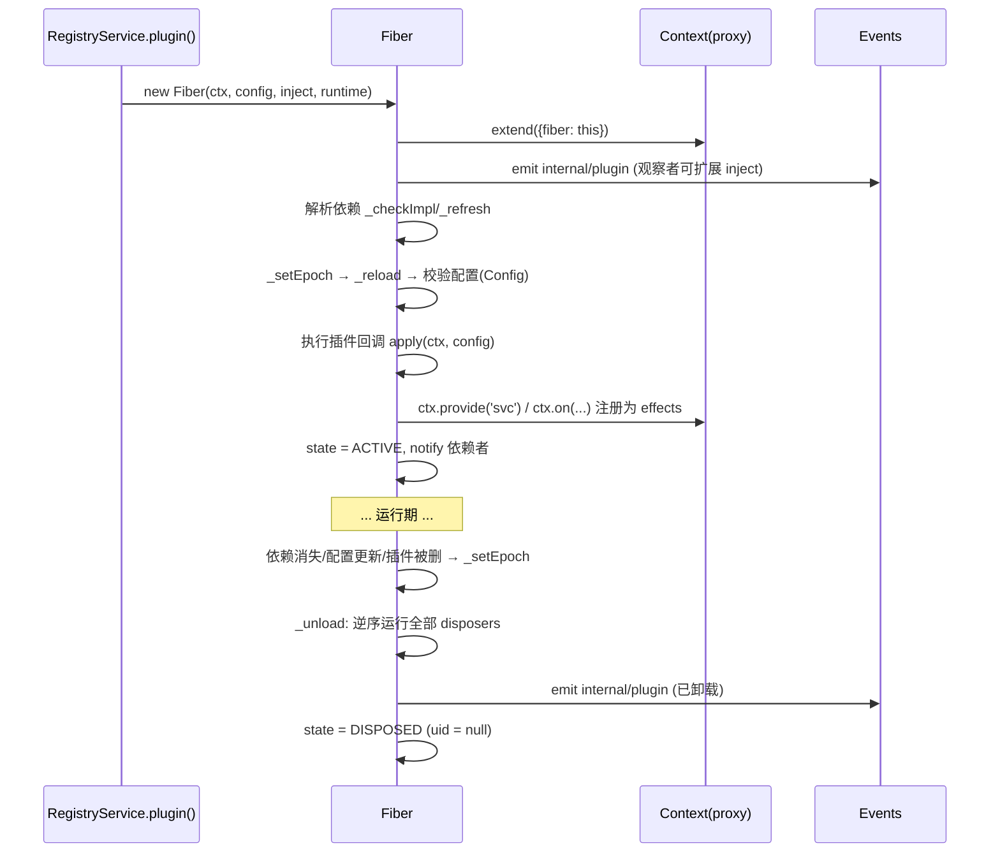

# 第 5 章 Cordis 源码解析：Service 与 Fiber 生命周期

上一章我们看到了 context 的"骨架"。本章填充两个"血肉"：**Service**（服务的基类与形态）和 **Fiber**（插件运行时的生命周期状态机）。

## 5.1 Service：服务的基类

`Service`（`service.ts:11-115`）是所有挂在 `ctx` 上的服务的基类。它的构造器做了三件事：

```ts
constructor(protected ctx: Context, name: string) {
  name ??= this.constructor['provide'] as string
  let self = this
  const tracker = { associate: name, property: 'ctx' }
  if (self[symbols.invoke]) {
    self = createCallable(name, joinPrototype(...), tracker)  // 可调用服务
  }
  self.ctx = ctx
  self.name = name
  defineProperty(self, symbols.tracker, tracker)
  self.ctx.reflect.provide(name, self, this[symbols.check])   // 注册！
  return self
}
```

要点：

1. **构造即注册**：`super(ctx, name)` 一调用，服务立刻通过 `ctx.reflect.provide()` 挂到 context 上——并且因为 provide 是 fiber effect，**fiber 卸载时服务自动消失**；
2. **可调用服务**：如果类实现了 `[symbols.invoke]`（`Service.invoke`），构造器会返回一个**可调用实例**（`createCallable`），例如 `ctx.logger('name')` 是函数式调用、`ctx.logger` 又带属性；
3. **check 谓词**：`[Service.check]` 作为 provide 的第三个参数，是"依赖者能否装载我"的可用性谓词；默认的 `[symbols.filter]`（`service.ts:61-63`）比较隔离标签，保证服务只在自己的隔离作用域内被解析。

`Service` 还提供：

- `[symbols.resolveConfig]`（`service.ts:86-102`）：沿拦截映射原型链收集 intercept 配置，`base` 垫底、`head` 置顶，经 `Config.merge`（若声明）或 `Object.assign` 合并——服务可在自己的 `Config` 上声明 `merge` 以自定义合并语义；
- `static [Symbol.hasInstance]`：跨代理识别实例；
- 静态 symbol 常量：`init`（类插件的构造后钩子）、`invoke`、`extend`、`tracker`、`config`（phantom 拦截配置类型参数）等。

## 5.2 Fiber：插件的"进程"

**Fiber**（`fiber.ts:184-753`）是"一枚插件的一次装载"的运行时记录。每个 `ctx.plugin(...)` 调用创建一个 fiber；根 context 的 fiber 是 uid 为 0 的"根纤维"。

### 状态机

```ts
// fiber.ts:147-154
export const enum FiberState {
  PENDING,    // 等待所需服务
  LOADING,    // 插件回调正在运行
  ACTIVE,     // 已装载、正在提供服务
  FAILED,     // 回调或配置抛出
  DISPOSED,   // 已移除，不可重启
  UNLOADING,  // disposers 正在运行
}
```

状态迁移在 `_updateState`（`fiber.ts:581-595`）中执行，每次迁移派发 `internal/status` 事件（携带旧状态），并在 ACTIVE ↔ 非 ACTIVE 翻转时 `notify` 该 fiber 提供的服务。

### 依赖纪元（epoch）

fiber 依赖管理的核心是一个巧妙的**纪元字符串**（`_refresh`，`fiber.ts:611-623`）：

```ts
_refresh() {
  let epoch = ''
  for (const name of Object.keys(this.inject)) {
    const impl = this._store[name]
    if (!impl) { epoch = INACTIVE; break }          // 缺依赖 → 停机纪元
    epoch += ':' + impl.fiber.uid                    // 依赖提供者的 uid
  }
  this._setEpoch(epoch)
}
```

纪元 = 所有注入服务的**提供者 fiber uid 拼接**。任何依赖的实现者换了（卸载、重载、被替换），uid 变化 → 纪元变化 → `_setEpoch` 触发重载或卸载：

- 纪元从 `INACTIVE`（依赖不齐）变到有效 → `_reload()`（进入 LOADING）；
- 纪元从有效变到 `INACTIVE` → `_unload()`（进入 UNLOADING）；
- 纪元值改变（依赖者换了实现）→ 先 `_unload` 再 `_reload`，**插件自动重启以适配新依赖实现**。

这就是 Cordis "装载顺序由依赖表达"的实现：`ctx.inject(['a','b'], cb)` 创建一枚依赖型插件，`a`/`b` 一出现就自动装载，一消失就自动卸载，换了实现就自动重启。dsh 里大量"监听某服务可用后再注册"的代码都建立在此之上。

### effect：副作用注册

`ctx.effect(execute, label)`（`fiber.ts:418-561`）是 fiber 的副作用容器：

- `execute` **立即执行**；
- 其返回值可以是：单个 disposer 函数、`Promise<disposer>`、可迭代对象（generator 逐项 yield disposer）、异步迭代器——`_execute`（`fiber.ts:356-400`）统一处理这些形态；
- 返回的 disposer 是**单发**的（重复调用 no-op），且**可 await**（disposer 也是 thenable，`wrapper.then`，`fiber.ts:555-559`）——即 `await dispose()` 会等清理完成；
- 每个 effect 带 `label`，通过 `getEffects()` 可查看诊断树（`EffectMeta`，`fiber.ts:96-101`）——这是 `cordis_inspect_self` 里"效果诊断"的数据来源；
- 所有 effect disposer 都注册进 fiber 的 `_disposables` 列表，**卸载时逆序执行**（`_unload`，`fiber.ts:675-696`：`this._disposables.clear().map(...)` 并行 + 逐个 `composeError` 包裹，单个清理失败只记录日志，不阻断其余清理）。

effect 的实现还处理了大量竞态：同步失败回滚、异步 setup 屏障、所有者卸载时的重入合并（`effectInertia`）、防 unhandled rejection 等——它是 Cordis 里防御性最强的代码之一。

### 配置校验

`resolveConfig`（`fiber.ts:50-62`）在装载前用插件的 `Config`（Standard Schema）校验配置：校验失败抛 `ValidationError`，列出每个 issue 及路径；异步校验明确不支持。dsh 的 loader 行配置（`config` 字段）都经过这条管道，所以"配置写错"会在启动时以清晰错误暴露。

### 装载与卸载

`_reload`（`fiber.ts:646-673`）：快照依赖 store → `await Promise.resolve()` 让出微任务（给竞态让路）→ 若纪元未变则解析配置并 `_execute(runner)`（真正运行插件回调）→ 失败则记录 `_error`、纪元置 INACTIVE。`_unload` 对称：清理所有 disposer → 按纪元决定结束还是重载。

`update(config, noSave)`（`fiber.ts:736-753`）：先走 `internal/update` **waterfall**（HMR、持久化钩子可以否决或替换重启），默认执行"校验新配置 → 重启"。这就是配置热更新的核心路径。

`restart()`（`fiber.ts:718-723`）：置 INACTIVE 纪元 → refresh → await——"卸载并立即以当前配置重载"。

### 发布与观察

fiber 创建后立即派发 `internal/plugin` 事件（`fiber.ts:302`），同步观察者（如 loader）可扩展其 `inject`；`emitPluginDisposed`（`fiber.ts:120-137`）在卸载时派发 `internal/plugin` 通知——每个观察者的失败都被隔离记录，不影响所有权清理。

## 5.3 一个插件的完整一生

把第 4、5 章串起来，一枚插件的生命周期：



## 5.4 小结

- `Service` 构造即注册、fiber 卸载即消失；
- `Fiber` 状态机：PENDING → LOADING → ACTIVE（→ FAILED/UNLOADING → DISPOSED）；
- 依赖纪元（epoch = 提供者 uid 拼接）驱动自动装载/卸载/重启；
- `ctx.effect` 统一副作用形态（函数/Promise/generator/异步迭代器），卸载逆序清理；
- 配置经 Standard Schema 校验，`internal/update` waterfall 让 HMR 与持久化可干预更新。

下一章：事件系统——五种派发模式。
