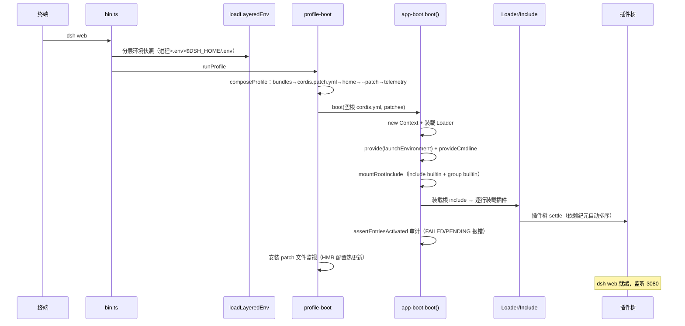

# 第 8 章 启动链路源码解析

本章追踪 `dsh web` 从命令行到插件树 settle 的完整路径。涉及三个文件：

- `apps/cli/src/bin.ts` —— 命令入口（53 行）
- `apps/cli/src/profile-boot.ts` —— profile 组合与进程生命周期（300 行）
- `packages/boot/app-boot/src/index.ts` —— 启动胶水（829 行）

## 8.1 bin.ts：按模式动态分发

`bin.ts` 极其精简，核心是**按模式动态 import**（`bin.ts:27-53`）：

```ts
const invocation = parseDshArgs(process.argv.slice(2), readVersion())
switch (invocation.mode) {
  case 'profile': { ... await import('./profile-boot.ts'); runProfile(...) }
  case 'plugin':  { ... await import('./plugin.ts');      runPlugin(...) }
  case 'dump-config': { ... runDumpConfig(...) }
}
```

三种模式：

- `profile`：默认模式，完整启动一棵插件树（`dsh web`、`dsh --profile headless ...` 都走这里）；
- `plugin`：插件管理子命令（安装/卸载等）；
- `dump-config`：渲染组合后的配置树（`dsh --dump-config`）。

`loadLayeredEnv('dsh')` 在分发前建立**分层环境快照**（见 8.2）。

## 8.2 分层环境快照

`loadLayeredEnv`（`app-boot/index.ts:177-198`）按"继承进程环境 > 调用目录 `.env` > Harness 主目录 `.env`"三层收集环境，生成不可变快照 `LaunchEnvironmentSnapshot`（记录每个值的来源层），并**只填充未设置**的变量。

这里有一个精心设计的安全约束：`BOOTSTRAP_NAMES` 与 `BOOTSTRAP_PREFIXES`（`index.ts:92-128`）列出的变量**禁止任何 `.env` 文件设置**——包括 `PATH`/`HOME`/`NODE_OPTIONS`、决定由哪个环境程序处理一项操作的（`EDITOR`、`PAGER`、`BROWSER`）、所有解释器钩子（`PYTHONPATH`、`RUBYOPT`…）、VCS 钩子、网络信任（`HTTP_PROXY`、`SSL_CERT_FILE`…），以及 `DSH_`/`XDG_`/`DYLD_` 前缀。理由（注释原文）：

> it decides how this process starts, where its code and instructions load from, or how it reaches the network

即：这些变量决定进程如何启动、代码从哪加载、如何联网，只允许启动环境提供。违反者直接抛错。

快照通过 `ctx.provide(DSH_LAUNCH_ENVIRONMENT_KEY, ...)` 在**任何配置树条目装载之前**注入（`profile-boot.ts:252`），插件在启动期读取的环境值全部来自同一份不可变快照。

## 8.3 profile-boot：组合与守卫

`runProfile`（`profile-boot.ts:207-300`）依次执行：

1. **组合 patch 栈**（`composeProfile`，`profile-boot.ts:142-171`）：
   - bundle 层（`dsh.profile.bundles` 顺序）→ profile 的 `cordis.patch.yml` → 用户级 `$DSH_HOME/cordis.patch.yml` → `--patch` 覆盖层 → 遥测开关；
   - 特别地，向 `agent-presets` 行追加随附的 preset 根目录（`SHIPPED_PRESET_ROOT`，本应用 config 旁的 `agent-presets/`），并处理 `DSH_TELEMETRY_DISABLED` 开关（`resolveTelemetryPatch`：**任何非空值都关闭遥测**，隐私开关宁可误关不可误开）；
2. **安装信号守卫**：`SIGTERM → exit 0`（监督者常规停止），`SIGINT → exit 130`（用户中断）；`installFailLoud` 把启动期未捕获 rejection 转为单条 stderr 诊断 + `exit(1)`；
3. **boot**：见下；
4. **热更新监视**：若树中没有 HMR 服务（web bundle 禁用了模块级 HMR），则挂载一个仅配置监视的 HMR 实例（`root: []`），并 `watchUserPatches` 监视 profile 与用户级两个 patch 文件——**改 `cordis.patch.yml` 即时生效**（8.5 详述）。

## 8.4 boot()：装载与审计

`boot`（`app-boot/index.ts:757-802`）：

```ts
export async function boot(binName, absoluteConfigPath, patches, prepare?, bareModuleBaseUrl?) {
  const ctx = new Context()
  let stage = 'host preparation failed'
  try {
    ctx.baseUrl = pathToFileURL(dirname(absoluteConfigPath)).href + '/'
    ctx.provide('dshHomePath', dshHomePath)
    await ctx.plugin(Loader)                      // ① 装载 Loader 服务
    await prepare?.(ctx)                          // ② 宿主准备（注入环境快照、cmdline）
    stage = 'plugin tree failed to load'
    await mountRootInclude(ctx, absoluteConfigPath, patches, bareModuleBaseUrl)  // ③ 根 Include
    await ctx.get('loader')?.await()              // ④ 等待整棵树 settle
    if (ctx.get('loader') === undefined) return ctx
    await assertEntriesActivated(ctx, binName)    // ⑤ 启动审计
    return ctx
  } catch (cause) {
    await ctx.fiber.dispose()                     // 失败则回卷
    throw new Error(`${binName}: ${stage}: ${detail}${stack}`, { cause })
  }
}
```

四个关键环节：

### ① Loader 服务

`ctx.plugin(Loader)` 装载 `@deepseek-ai/cordis-plugin-loader`——Cordis 的"装载器"服务：管理 entry（配置行）、fiber 与 HMR 的事务性装载。

### ③ 根 Include：配置树的入口

`mountRootInclude`（`index.ts:486-529`）做三件事：

1. 把 **Include** 插件注册为 loader 的 `include` builtin（`ctx.loader.builtins.include = Include`）——Include（`@deepseek-ai/cordis-plugin-include`）负责解析 `cordis.yml` 入口列表与 patch 语义；
2. 把 **Group** 插件注册为 `group` builtin（`ctx.loader.builtins.group = Group`）——`cordis:group` 行用于给一组行共享一个 `isolate` realm（agent preset 机制的地基，见第 16 章）；
3. 创建 id 固定为 `'include'` 的根 entry：`{ id: 'include', name: 'cordis:include', config: { path: <配置文件 URL>, patches } }`，事务性装载它——Include 随之装载配置文件里的所有行。

注意 patch 的传递顺序与克隆：`allPatches(composed)` 与 `composeLive` 都 `structuredClone` 再传（`profile-boot.ts:240-248`）——因为 Include 的 `insert` 行是**按引用**推入装载树的，后续 id 定向 patch 会原地修改这些对象；不克隆的话，一次用户覆盖会被"烘焙"进 bundle 的内存插入行，删除覆盖后无法恢复默认。这是全书第一个值得记住的"引用别名"陷阱。

### ④ 等待 settle

`ctx.get('loader')?.await()` 等待整棵树（含 Include 装载的所有 entry）达到稳定态。每一步 await 后都重查 loader 是否存在——因为"一个一次性 surface 可能在启动中途就完成并 dispose 整棵树"（如 headless 快速任务），此时应正常返回而非崩溃。

### ⑤ 启动审计

`assertEntriesActivated`（`index.ts:692-725`）：

- 无 fiber 且未禁用的 entry → `plugin(s) failed to load`（模块解析失败）；
- `FAILED` → await fiber 恢复原始 rejection，把**每枚失败插件的原始 stack** 拼进诊断；
- `PENDING` → 报告缺少的服务名：`pending (waiting for services: a, b)`；
- 失败时先经过一个"Loader rejection 检查点"（`observeLoaderRejectionCheckpoint`，`index.ts:565-572`）——把已计入的 rejection 保留到 `installFailLoud` 的进程检查点通过后再释放，避免同一失败被报告两次。

`assertEntriesLoaded`（`index.ts:658-664`）只检查"fiber 缺失"，是上面的前置检查。

### 失败回卷

`catch` 中 `await ctx.fiber.dispose()` 回卷整棵树（根 fiber 的 dispose 会清理所有子 fiber），然后包装错误：`stage`（区分"宿主准备失败"与"插件树装载失败"）+ 逐层 `cause` 链解包到**最深的原始错误**并附其 stack——保证启动失败时开发者看到的是真正的出错位置。

## 8.5 配置热更新：watchUserPatches

`watchUserPatches`（`index.ts:232-265`）通过 HMR 服务的 `registerConfig(file, handler)` 注册文件监视：

```ts
const register = hmr.registerConfig(filename, async () => {
  const { patches, ...includeConfig } = entry.options.config as Include.Config
  const userPatches = loadOptionalPatches(binName, filename) ?? []
  const patches2 = compose(userPatches)
  await entry.update({ config: { ...includeConfig, patches: patches2 } })
})
```

用户编辑 `cordis.patch.yml` → HMR 回调 → **重新读取 patch 并 `entry.update()` 更新根 Include 的配置** → Include 事务性地重放 patch 算法，变更的行即时生效。

两个细节：

- 每代刷新都**重读两个用户文件**（HMR 监视器只提供变更文件本身的 patches，重读可避免两个监视器拼接彼此过期副本）；
- `composeLive` 每代重新 `structuredClone`（同样是为了引用别名安全）。

若树中已有 HMR 服务则跳过（避免双份），否则先确保 `timer` 服务存在再装载 `cordis-plugin-hmr`（`profile-boot.ts:279-284`）。

## 8.6 fail-loud 与终端恢复

`installFailLoud`（`index.ts:609-649`）处理"装载完成后才出现的未捕获 rejection"：写一条 `dsh: fatal load failure: <stack>` 到 stderr 后 `exit(1)`。特殊场景：持有终端的 surface（如 ACP 或交互式终端模式）需要先把终端交还用户——`release` 钩子（terminal owner 提供）在 `FAIL_LOUD_RELEASE_TIMEOUT_MS = 2000ms` 上限内被 await（超时定时器保持引用，防止 Node 空事件循环直接 exit 0）。单个 latch 保证第一个 rejection 是上报的那一个，后续 rejection（含 release 自身的）静默落入待决退出。

## 8.7 启动时序总览



## 8.8 小结

- `dsh` 三模式分发：profile / plugin / dump-config；
- 环境快照分层收集、bootstrap 变量禁止 `.env` 覆盖；
- `boot()` = Loader + 根 Include + 等待 settle + 启动审计；失败回卷并解包最深原因；
- patch 引用别名陷阱 → 每代克隆；
- `cordis.patch.yml` 热更新由 HMR + `entry.update()` 实现；
- fail-loud 保证任何启动失败都有单条清晰诊断。

下一章深入 Profile/Bundle 组合机制本身。
