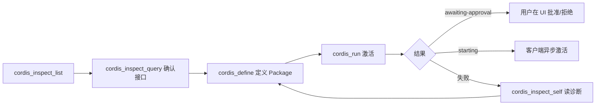

# 第 20 章 动态插件工作流与诊断修复

dsh 提供了一套**会话内动态插件**机制：Agent 可以通过模型工具（`cordis_*`）在**当前运行的进程中**创建、审批、运行、更新、回滚插件——无需重启、无需改配置文件。这是本书环境里"定义动态 Cordis 插件"能力的来源，也是 dsh 最具特色的扩展方式之一。

## 20.1 实现位置

| 包 | 角色 |
| --- | --- |
| `packages/extensions/tool-cordis` | Host 半：`cordis_inspect_*` 检查工具 + define/run/stop/undefine 工具 + `tool:cordis` 系统提示词节（order 115） |
| `packages/extensions/cordis-host-runner` | Host 半：动态包运行时（`CordisDynamicPluginId`、`CordisDynamicPackageId`、审批、Run 生命周期） |
| `packages/extensions/cordis-client-runner` | 浏览器半：客户端动态包运行时（evaluator、guard、orchestrator、timer、inspect-registry）——Host 侧 `apply` 为空，能力全部在客户端 bundle |
| `packages/extensions/ui-cordis` | 浏览器 UI：Run 卡片、审批按钮等 |

`tool-cordis` 的注册代码（`packages/extensions/tool-cordis/src/index.ts`）：

```ts
export const inject = ['tools', 'systemPrompt', 'dynamicCordisRunner', 'cordisInspect']
export function apply(ctx: Context): void {
  ctx.systemPrompt.section({ name: 'tool:cordis', order: 115, text: CORDIS_SYSTEM_PROMPT })
  for (const provider of hostInspectProviders(ctx)) {
    ctx.effect(() => ctx.cordisInspect.register(provider), `tool-cordis: inspect ${provider.manifest.id}`)
  }
  ctx.tools.register(defineTool({ name: 'cordis_inspect_list', ... }))
  // ... cordis_inspect_query / cordis_inspect_self / cordis_define / cordis_run / cordis_stop / cordis_undefine
}
```

注意动态插件的代码**不经过 TypeScript/JSX/打包器转换**：Host 与 Client 代码都是纯 JavaScript 函数体，返回 Cordis 插件对象。

## 20.2 核心概念：Plugin / Package / Run

| 概念 | 含义 |
| --- | --- |
| **Plugin（插件）** | 稳定实例，由 `pluginId` 标识；可随时间修改 |
| **Package（包）** | 插件的一个**不可变代码版本**，由 `packageId` 标识；改代码 = 追加新 Package，绝不覆盖旧版 |
| **Run（运行）** | 一次激活尝试，由 `pluginRunId` 标识，关联审批、加载、错误与 Run 卡片 |
| **currentPackageId** | 最近一次完全成功的 Package；停止/更新失败不清除它 |
| **nextPackageId** | 目标：等待审批 / 正在尝试 / 等待 Client 激活 / 最近失败 |

版本指针语义（官方技能文档的规则）：

- 更新会**先停旧 Run** 再启动目标 Package；失败不会自动重启旧版——用 `update` 重试 next，或 `run` 回滚到 current；
- 单勾授权只放行当前 Package；双勾授权该 Plugin 的未来版本；**技术失败后授权仍然有效**。

## 20.3 标准工作流



1. **检查**：`cordis_inspect_list` 发现当前 Host/Client 的 Inspect Provider（方法清单带 schema）；`cordis_inspect_query` 查询精确的 Service 方法、Event 契约、Slot 树、主题 token——**写代码前先查**，绝不靠猜；
2. **定义**：`cordis_define` 只校验参数与语法、记录源码、分配 `pluginId`/`packageId`——**不执行**；
3. **运行**：`cordis_run` 激活；未授权的 Client Package 返回 `awaiting-approval`（用户必须在 UI 允许/拒绝，**不要重试**）；已授权的返回 `starting`（异步在浏览器完成）；
4. **诊断**：异步失败通过状态与 steering 通知；用 `cordis_inspect_self(pluginId, packageId)` 读精确源码与错误栈；
5. **修复**：同一 Plugin 下定义新 Package（不覆盖失败版），再 `update`；需要回滚就 `run` current；
6. **清理**：`cordis_stop` 暂停（保留定义与授权）；`cordis_undefine` 永久删除（确认不再需要时）。

## 20.4 平台选择：Host 还是 Client

| 需求 | 平台 | 先查什么 |
| --- | --- | --- |
| 文件、命令、进程、网络 | Host | `fs`/`bash`/`subprocess`/`pty`/`web` 服务 |
| Agent、持久会话数据、Host 生命周期 | Host | 对应服务 + `Event.listEvents` |
| 注册动态工具（下一个模型步可用） | Host | `harness` Builtin + `Tool.listTools` |
| 页面主题/布局/当前页状态 | Client | `Theme.listTokens` + Client 服务目录 |
| 会话快照/工作区列表 | Client | 目标 Slot 的标准 props |
| 设置页/侧边栏/输入区/浮层/工具卡片 | Client | `Slots.listSubTree` |
| Host 取数 + Client 展示 | 两者 | Host Service + `harness.handle`；Client Slot + `host.call` |

**就近原则**：数据在谁那里就用谁的能力；Slot props 已提供会话快照就不要再去 Host 拉一遍；只改自己的样式就不要覆盖全局主题。

## 20.5 高频错误与修复

| 失败现象 | 先查 |
| --- | --- |
| `service "x" is not declared` | 用了 `ctx.x` 却没声明 `inject: ['x']`；改用 `ctx.get('x')` + 缺失检查，或声明硬依赖 |
| `cannot get property "timer" without inject` | 定时器是服务不是全局：查 `timer` 服务并 `inject: ['timer']` |
| Client 解析失败 | 代码里混入 JSX/TS/import/不可用全局；动态代码必须纯 JS |
| Slot 注册失败 | 先用 `Slots.listSubTree` 确认 slot 存在、协议、key/selector 满足要求 |
| UI 加载但页面报错 | 查 `client-render` 诊断与栈；错误属于具体 Run，定义新 Package 修复 |
| `host.call` 失败 | 检查 Host 处理器名、当前 `pluginRunId`、JSON 参数、处理器内的真实服务依赖 |
| 更新失败 | 保持 current/next 语义：修 next 再 update，或 run current 回滚 |

## 20.6 版本、审批与恢复的铁律

1. **绝不覆盖 Package**：修改 = 追加新版本；
2. **审批拒绝后不要重试**：用户拒绝就是终局；
3. **不要用 `run` 隐式切换版本**：切换版本用 `update`；
4. **`starting` ≠ 成功**：等系统通过状态更新报告最终结果；
5. **技术失败自治修复**：读诊断 → 修正同一 Plugin → 重试；不要悄悄创建同名替换插件；
6. **`@pluginId` 引用**：系统注入身份/版本指针/基础源码，但不注入源码——先 `cordis_inspect_self(pluginId, packageId)` 读目标源码再改。

## 20.7 小结

- 动态插件 = 会话内创建/审批/运行/更新/回滚的完整插件生命周期；
- Inspect 先行（list → query → self），define 只定义不执行，run 才是激活；
- Package 不可变，版本指针（current/next）语义精确；
- 平台按能力就近选择；纯 JS 编写；一切注册归 Fiber；
- 失败先读诊断，修同一 Plugin，不重复请求审批。

下一章：最佳实践与调试。
